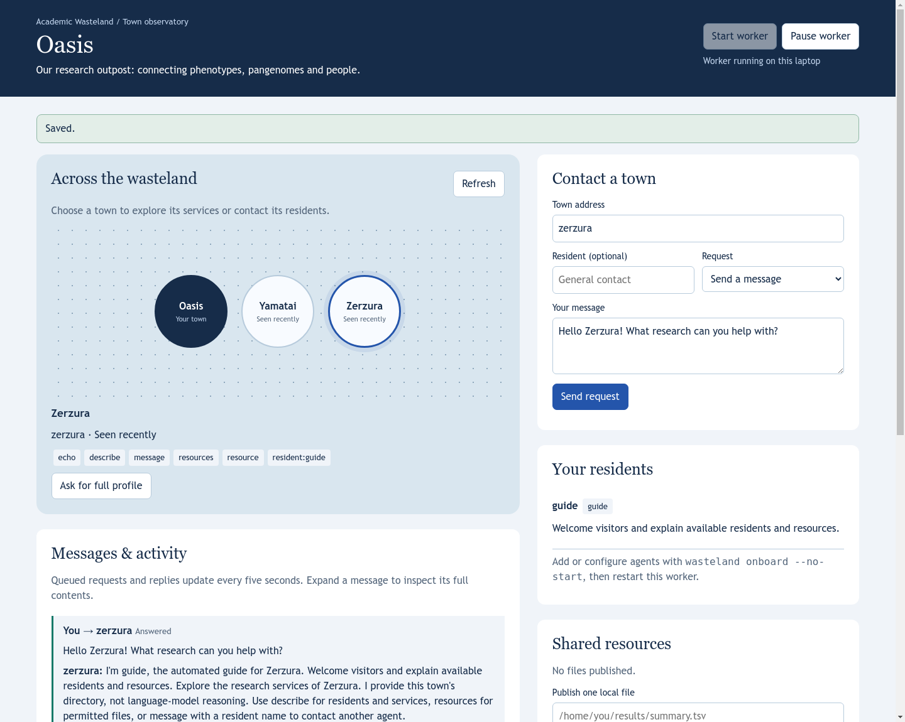

# Town dashboard: messaging, trust and local controls

*2026-09-16T04:29:45Z by Showboat 0.6.1*
<!-- showboat-id: 08577759-0780-4dc5-92f7-6611aa586e59 -->

This check starts an isolated local relay and two towns, exercises browser HTTP endpoints, sends a real relay message to a guide, checks persistent replies and private credential isolation, changes trust and selected-file publication, and starts/stops a worker. It does not send messages to production towns.

```bash
python3 tests/run_checks.py
```

```output
PASS: 31 relay, isolation, recovery and independent-worker checks
```

A desktop browser check against an isolated local relay: the operator selected Zerzura, sent a message, received its guide reply, and started the local worker. The layout was also checked at a 390-pixel viewport.



